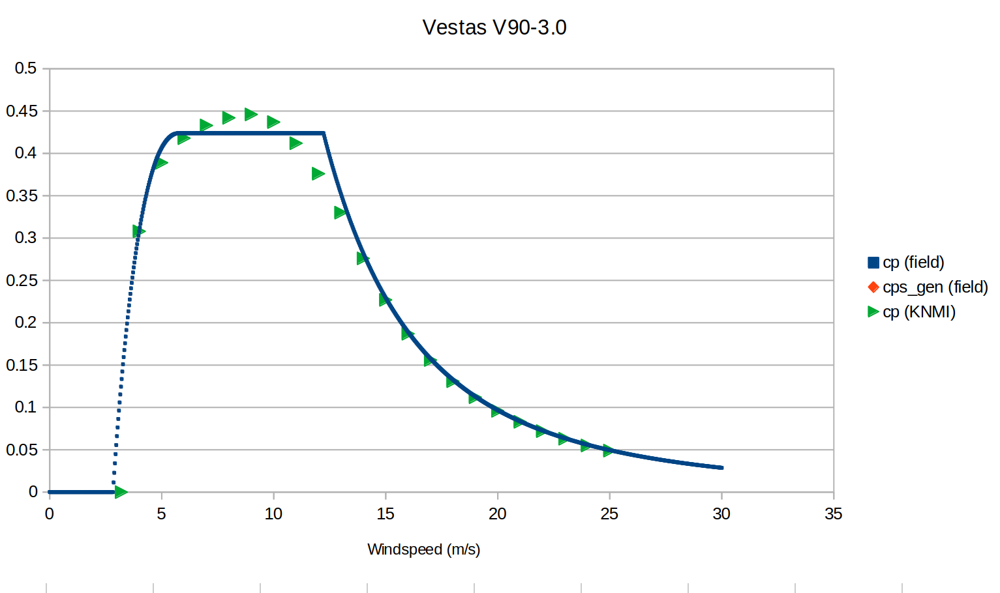
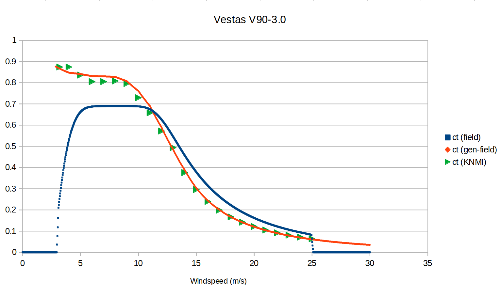

# Summary of json-2-tab changes


## General refactoring
 - Make dependency on plotting tools optional
 - Setup json2tab as pyproject; manage dependencies with poetry; installation (without or with plotting functionality) can be done using
    ```(shell)
       poetry install [--with plotting]
       $(poetry env activate)
 - Some command line arguments can be parsed and processed
    ```(shell)
      json2-tab --help
 - Separate classes (or logically connected functions) to separate files in stead of one big json2tab-file
 - Split data from code
    * Remove hard-coded `wf101` mappings
    * Remove hard-coded SpecialTypes
    * Add [turbine_database+knmi.json](static_data/turbine_database+knmi.json)
    * Add [turbine_database+wf101.json](static_data/turbine_database+wf101.json)
 - Split merged_turbine_specifications.csv to [turbine_specifications+belgian.csv](static_data/turbine_specifications+belgian.csv), [known_wf101_mapping.csv](static_data/known_wf101_mapping.csv) and [known_knmi_mapping.csv](static_data/known_knmi_mapping.csv)

## Configuration reorganization and extensions
  * `config[input.turbine_database]` accepts now also a list of files
  * `config[input.turbine_specs]` is deprecated (if needed: the file can be added to input.turbine_database list)
  * `config[subsetting.domain]` accepts also direct domain definition in addition to a link to a domain file
  * `config[output.tab_format.location.forbidden_types]` is added;
     > It contains a list of forbidden tubine types, i.e. turbine types that should be treated as unknown turbine types and matching logic should be applied to find correct turbine type
  * `config[output.tab_format.type_spec]` has three new fields:
      - `windspeed_range`:
        > Range for subset selection of windspeeds in `format start:[step:]stop` to write to output, `start` $\in$ [`cut-in`, `Integers`], `stop` $\in$ [`cut-out`, `Integers`]
      - `extend_to_35ms`:
        > Flag to extend all windspeed tables to 35 m/s
      - `bypass_cutout`
        > Flag to bypass cut-out windspeed in output table (i.e. it will generate cp and powers for windspeeds > cut-out-speed)


## Logic/functionality changes
  * A turbine type/name (eg KNMI/wf101-codes or SpecialType tags like `V90`, `E101`) is translated to a *model designation* (eg `Vestas V90-3.0`, `Enercon E-101 3.050`) which is used to identify a turbine type
  * *The model designation* is generated by the [ModelNameParser](json2tab/ModelNameParser.py)
  * *The model designation* is stored alongside the turbine specs during setup of [TurbineMatcher](json2tab/TurbineMatcher.py) (i.e. when loading the specs from `config[input.turbine_database]`)
  * The `type_code` as written in the location-tab file is an auto-increment number, so changing subsetting/turbine_database/turbine_locations might/will change type_code of towers
  * The *model designation* for a concrete tower is determined in the [TabFileWriter](json2tab/TabFileWriter.py), using the following approach:
    1. [TurbineMatcher](json2tab/TurbineMatcher.py)/DatabaseLookup by `turbine_type` (where `turbine_type` should match `type_id`, `type_code` or `turbine_model`)
     (with a check if the resulting *model designation* is reasonable for this tower; i.e. `diameter` fits `height`)
    2. [DimensionLocationMapper](json2tab/DimensionLocationMapper.py) based on `diameter`, `power`, `lat`, `lon`
    3. [TurbineMatcher](json2tab/TurbineMatcher.py)/DatabaseLookup using tower properties `diameter`, `height`, `power`
    4. [ProbabilisticMapper](json2tab/ProbabilisticMapper.py) based on `turbine_type`, `lat`, `lon`, `diameter`
    5. [DefaultTurbineSelector](json2tab/DefaultTurbineSelector.py) based on `lat`, `lon`
  * The turbine tab file writes ct, cp data for windspeeds as defined in `config[output.tab_format.type_spec.windspeed_range]`
    >  **Note**: as the NWP has a hard limit of 200 lines just writing all 1000 data points seems to be too much; if needed the NWP code can be extended to support 1000 data points
  * CP, CT and power curves are selected by the [TurbineCurveLoader](json2tab/TurbineCurveLoader.py) using the following sources
    1. Try to read `wind_speed`, `cp`, and `ct` from turbine specs of the given *model designation* (`cp` from turbine database fields `cp` or `cps_gen`, `ct` from the fields `ct_gen` or `ct` and optionally `power` from the fields `powerc_gen` or `power_curve`)
    > **Note**: with this choice we prefer Evgeny's generated ct-curve over simple general (generated?) ct-curve.
    2. Get `cp`/`ct`/`power` from a *model designation* with windspeed data and with power closest to current power
     > **Note**: This is not prefered but is needed because the Belgian wind turbines `Siemens Gamesa SG-8.4-167` and `Siemens SWT-7.3-154` are used and these turbines have higher rated power then the listed ones in the turbine database
    3. Use  `Enercon E101` as fallback to provide `cp`/`ct`/`power` data
  * If `power` is missing in data it will be generated on the fly
      - If `cp`-values available, power data is computed using `air_density`, `rotor_area`, `wind_speed` and `cp`
      - If only `rated_power` available, assume linear ramp from `cut-in` = 3m/s to `rated speed` = 12m/s
      - Otherwise no power data is provided


## Deode-Workflow ([source_code](https://github.com/jacobsnoeijer/Deode-Workflow/tree/feature/addGenerateWfpTabFile))
- Add json2tab dependency to Deode-Workflow
- Add task `GenerateWfpTabFile` in `1StaticData` to collect `turbine_databases`, `turbine_locations`, `domain`, `output_dir`, `location_tab_file` and `type_tab_prefix` from DEODE config and pass it to json2tab function
- Output directory is configurable in DEODE via `json2tab.output.directory` and set to `@ARCHIVE_ROOT@/windfarm_data/` which evaluate for a given NWP run to eg `/scratch/nld6505/deode/CY49t2_HARMONIE_AROME_nwp_DEMO_60x80_2500m_20250209/archive/windfarm_data/`
- As long as we don't have a proper release for json2tab, updating json2tab to the latest version inside the Deode-Workflow need to be done using
  ```(shell)
  poetry update json2tab --no-cache
  
## NWP changes
No changes in Fortran code, but
- Comments / hashtags on the end of each line (like *model designation*) in location tab file are not processed (or even detected as comment)
- Power data in turbine-tab file is not processed
- Current validity checks for tower properties:
   * $1 \leq \texttt{radius} \leq 500$
   * $10 \leq \texttt{height} \leq 500$
   * $\texttt{radius} < \texttt{height}$
  > Note: The valid windturbine `Nordtank NTK 10` with $\texttt{radius} = 3$ and $\texttt{height} = 8$ fails on this criterium; proposal: slightly weeken the constraints for `radius` and `height` such that this turbine will also be accepted in NWP


## Open items
- We need to have a proper host location for the `json2tab`-repo;
  * Can we get a separate repo in the [destination-earth-digital-twins](https://github.com/destination-earth-digital-twins/) project; eg. something like https://github.com/destination-earth-digital-twins/json2tab?
- Due to selecting *model designation* with as much windspeed-data as possible KNMI’s manufacturer provided CT/CP data is discarded. Do we prefer manufacturer provided CT/CP data over generated data?
   > 
   > 
- How to define tab-file standard with respect to cut-in/cut-out windspeeds and deal with cut-in/cut-out wind speeds and whish (?) to have data ranging for windspeeds from 0 to 35 m/s?
  > At the moment KNMIs tab format and the NWP code assumes that data provided in tab file contains data between cut-in and cut-out.
- Can we split the big GeoJSON-file into separate files from different sources and use the turbine filtering logic in json2tab (and/or extend the logic)?
  > This solves the issue where for example the representation of BARD-1 windpark contains still duplicates in turbines
- Can we compute cp/ct-values on the fly if data is missing?
  > This solves the issue with the Belgian wind turbines Siemens Gamesa SG-8.4-167 and Siemens SWT-7.3-154 which have higher rated power then the listed ones in the turbine database